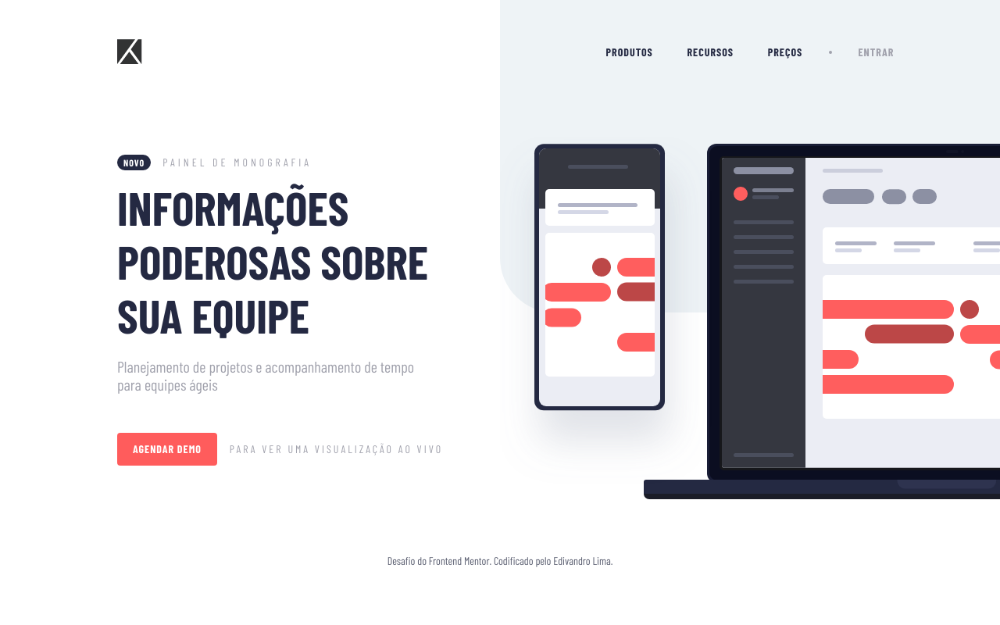

# Componente de introdução ao acompanhamento de projetos
Este é meu envio ao desafio do [Frotend Mentor](https://www.frontendmentor.io/profile/EdivandroLima).

[Clique aqui]() para ver como ficou.

## Ferramentas utilizadas
- HTML
- CSS
- JavaScript
- Google Fonts
- Normalize CSS
- HTML5Shiv

